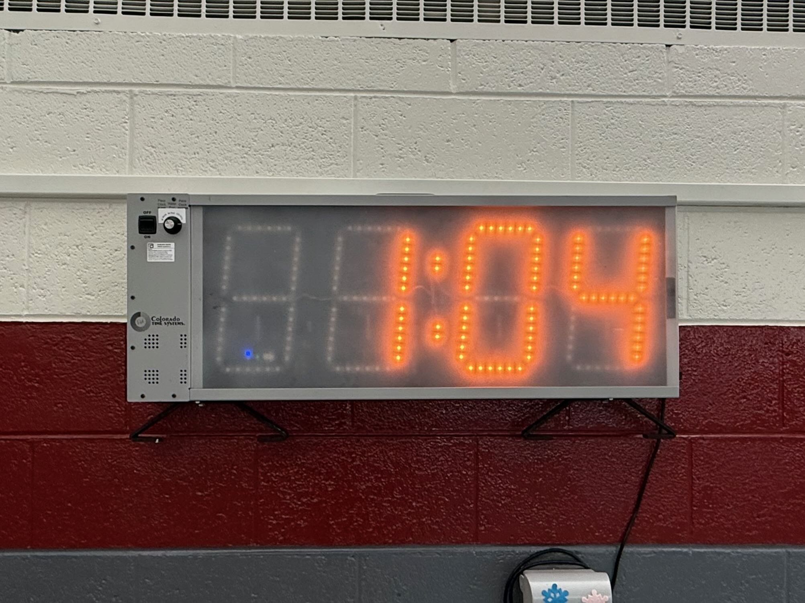
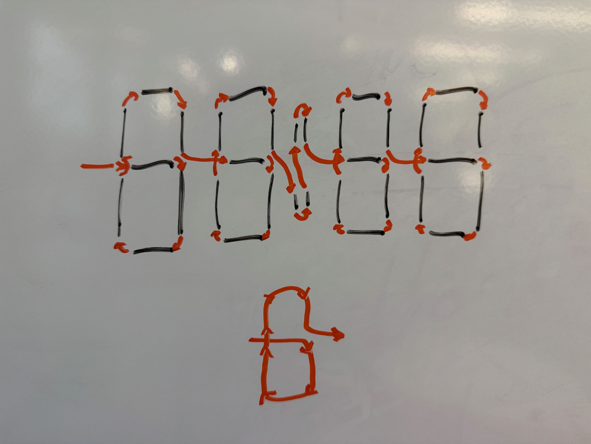
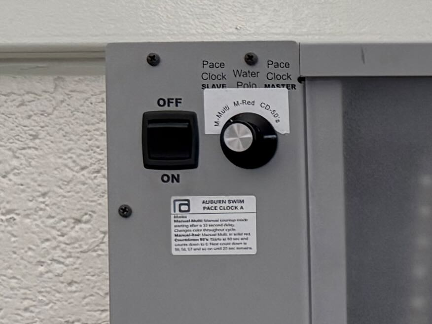
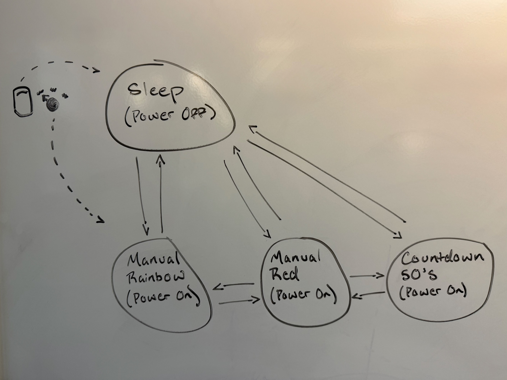

# particle-pace-clock

A custom pace clock designed for swim practices



## Background

### Motivation + Overview

Have you ever had to deal with 2 overpriced and outdated pace clocks breaking for seemingly no reason during swim practice in high school? Well, I did. (drumroll sounds) Introducing the Particle Pace Clock, a state-of-the-art, multi-color, over-engineered digital clock system designed for pacing swim practices. This clock is essentially a strip of RGB leds (Neopixels) connected to a microcontroller (Particle Argon) that displays the time from 00:00 to 59:59 (mm:ss) over and over (in any color you'd like). It probably doesn't sound that cool, but trust me, it is a far cry from what it used to be.

In 2019, I gutted and retrofitted 2 Colorado Time System clocks with the hardware + software described below. They are still in use today at Auburn High School in Rockford, IL and performing exceptionally well.

### What is a Pace Clock?

A pace clock is a device used to time and pace swim practices. It is typically used to ensure that swimmers complete their sets within a certain time frame.

Here's an example snippet of a workout used in a typical swim practice:

```
10 x 50 free @ 1:00
4 x 75 IM order @ 1:30
```

Let't dissect this a bit:

- 10 x 50 free @ 1:00
  - 10 is the number of repeats
  - 50 is the distance of each repeat
  - free(style) is the stroke
  - 1:00 is the time per repeat
- 4 x 75 IM @ 1:30
  - 4 is the number of repeats
  - 75 is the distance of each repeat
  - IM is the stroke (individual medley, a combination of the 4 strokes: backstroke, breaststroke, butterfly, and freestyle)
  - 1:30 is the time per repeat

The pace clock is used to ensure that the swimmer completes each repeat within the given time. For example, in the 10 x 50 free @ 1:00, the swimmer will likely start "at the top" (a nod to analog clocks) at, say "08:00", swim, and rest until the clock reaches "09:00". They will repeat this 10 times, using the clock to keep track of time and pace.

The same goes for the 4 x 75 IM @ 1:30. The swimmer will start at "04:00" and rest until the clock reaches "the bottom" of the clock at "05:30".

## Features & Modes

The Particle Pace Clock is a versatile and customizable digital clock designed specifically for swim practice pacing. It offers several features and modes to enhance training sessions and provide a modern alternative to traditional pace clocks.

### Features

1. **Multi-Color Display**: uses a strip of WS2812B NeoPixels to display time in vibrant colors.

2. **Mesh Networking**: synchronizes time across any number of clocks using Particle's mesh networking capabilities.

3. **User-Friendly Controls**: equipped with a main power switch and a 3-stop rotary switch for easy mode selection.

4. **Customizable Timing**: displays time in a format of MM:SS (minutes and seconds), suitable for swim practice intervals.

5. **Robust and Reliable**: built with durable components to withstand the rigors of daily use in a pool environment. 2 clocks have been in use since 2019.

### Modes

1. **Sleep Mode**:

   - The default state when the power switch is off.
   - The display is turned off, and the onboard status LED is set to a dim blue color.
   - Conserves power and extends the lifespan of the LEDs.

2. **Manual Rainbow Mode**:

   - Displays elapsed time (from 00:00 to 59:59 in MM:SS format) with cycling rainbow colors.
   - Provides a visually engaging way to track time during practice.
   - Clock will automatically turn off after 4 hours of operation.
   - Activated by selecting the manual rainbow position on the rotary switch.

3. **Manual Red Mode**:

   - Displays elapsed time (from 00:00 to 59:59 in MM:SS format) in a solid red color.
   - Offers a clear and straightforward display option for timing intervals.
   - Clock will automatically turn off after 4 hours of operation.
   - Activated by selecting the manual red position on the rotary switch.

4. **Countdown 50 Mode**:
   - Implements a specialized countdown timer for swim training.
   - Starts with a 30-second preparation period followed by a countdown from 60 seconds, decreasing by 1 second each round.
   - Swimmers must complete 50 yards/meters of swimming within each round.
   - If they cannot complete the 50 yards/meters within the interval, they are "out".
   - Can support 3 groups of swimmers, each group having their own countdown timer
     - Group is shown on the leftmost digit during the last 10 seconds of each round, G\_:SS.
     - Make sure fast swimmers are in the group 1 or 2 — once the round duration is 30 seconds or less, group 3 will not be given a countdown.
   - Colored "warnings" (green -> yellow -> orange -> red) are given when the swimmer is nearing the end of the countdown.
   - At the end of the countdown, the completed interval time is briefly shown on the clock in red.
   - Clock will automatically turn off once round duration is 20 seconds (sorry, no world record attempts here).
   - Activated by selecting the countdown 50's position on the rotary switch.

These features and modes make the Particle Pace Clock so much better than what is currently available on the market (they only count up, in solid red, and that's it). Built by a swimmer, for swimmers.

## Hardware Specifications

The Particle Pace Clock is built using a Particle Argon microcontroller and a strip of WS2812B RGB LEDs (commonly known as NeoPixels). Below is a detailed description of the hardware setup, including pinouts and wiring instructions.

### Components

- **Particle Argon**: A powerful microcontroller with built-in Wi-Fi and mesh networking capabilities.
- **WS2812B NeoPixel Strip**: A strip of individually addressable RGB LEDs used to display the time and various animations.
- **Switches**: Used to control different modes of the clock, such as power, countup, and special countdown modes.

### Pinouts

The following table describes the pin connections used in the project:

| Component             | Pin on Particle Argon | Description                                          |
| --------------------- | --------------------- | ---------------------------------------------------- |
| NeoPixel Data Line    | D8                    | Data line for controlling the LED strip.             |
| Power Switch          | D7                    | Toggle to power the clock on and off.                |
| Manual Rainbow Switch | D4                    | Rotary switch to select manual countup rainbow mode. |
| Manual Red Switch     | D5                    | Rotary switch to select manual countup red mode.     |
| Countdown 50's Switch | D6                    | Rotary switch to select countdown 50's mode.         |

### Wiring Diagram

Below is a simplified wiring diagram for connecting the components:

```
+-------------------+       +-------------------+
| Particle Argon    |       | NeoPixel Strip    |
|                   |       |                   |
| D8 -------------->+------> Data In            |
|                   |       |                   |
| GND --------------+------> GND                |
|                   |       |                   |
| 3V3 --------------+------> VCC                |
+-------------------+       +-------------------+

+-------------------+       +-------------------+
| Particle Argon    |       | Switches          |
|                   |       |                   |
| D7 -------------->+------> Power Switch       |
| D4 -------------->+------> Manual Rainbow     |
| D5 -------------->+------> Manual Red         |
| D6 -------------->+------> Countdown 50's     |
|                   |       |                   |
| GND --------------+------> Common GND         |
+-------------------+       +-------------------+
```

### 4-Digit 7-Segment Display Layout

The Particle Pace Clock uses a 4-digit 7-segment display to show time and other information. Each segment is 6 LEDs = 6 LEDs x 7 segments x 4 digits = 168 LEDs. Each "dot" is 2 LEDs = 2 LEDs x 4 dots = 8 LEDs. Total LEDs = 168 + 8 = 176 LEDs. Below is a representation of the layout for all four digits, including the dots in the middle:

**Labeled Segments**

```
  --f--   --f--        --f--   --f--
 |     | |     |      |     | |     |
 e     g e     g  oo  e     g e     g
 |     | |     |  oo  |     | |     |
  --a--   --a--        --a--   --a--
 |     | |     |      |     | |     |
 d     b d     b  oo  d     b d     b
 |     | |     |  oo  |     | |     |
  --c--   --c--        --c--   --c--

  [D1]    [D2]   Dots   [D3]    [D4]
```

**Wiring Pattern**



- **Digits**: D1, D2, D3, and D4 represent the four digits of the display.
- **Segments**: Each digit consists of segments labeled a through g.
- **Dots**: The dots are located between the second and third digits and can be used for various display modes.

This layout is used in the Particle Pace Clock to display time in a format such as MM:SS (minutes and seconds).

### Controls

The controls for this clock is fairly simple: one main power switch and 3-stop rotary switch. The rotary switch is used to select the mode of the clock. Check out the scrappy sticker I superimposed over the original modes.



### Additional Notes

- **Power Supply**: Ensure that the NeoPixel strip is powered with a suitable power supply capable of providing enough current for all LEDs. Each WS2812B LED can draw up to 60mA at full brightness (white color). 176 LEDs x 60mA = 10.56A peak draw. I skated by with a [12V 10A power supply](https://www.adafruit.com/product/658).
- **Resistor**: It is recommended to place a 300-500 ohm resistor between the Particle Argon data pin (D8) and the NeoPixel data line to protect against voltage spikes.
- **Capacitor**: A large capacitor (1000µF, 6.3V or higher) across the power and ground lines of the NeoPixel strip can help prevent power surges.

This setup allows the Particle Argon to control the NeoPixel strip and respond to button inputs, enabling various display modes and animations for swim practice pacing.

## Software Overview

The software for the Particle Pace Clock is written in C++ and leverages the Particle library to control the Particle Argon microcontroller and the NeoPixel LED strip. A key component of the software is the state machine, which manages the different operational modes of the clock.

### State Machine

The state machine is responsible for handling the clock's behavior based on user inputs and elapsed time. It operates in several distinct states, each corresponding to a different mode of operation. The state machine transitions between these states based on button inputs and internal logic.

#### States

1. **Sleep State**:

   - The display is turned off, and the onboard status LED is set to a dim blue color.
   - The clock enters this state when the power switch is off.
   - Transitions to an active state when the power switch is turned on.

2. **Manual Rainbow State**:

   - Displays elapsed time with cycling rainbow colors.
   - Transitions to this state when the manual rainbow switch is activated.
   - Returns to sleep state if the power switch is turned off.

3. **Manual Red State**:

   - Displays elapsed time in solid red color.
   - Transitions to this state when the manual red switch is activated.
   - Returns to sleep state if the power switch is turned off.

4. **Countdown 50 State**:
   - Implements a specialized countdown timer for swim training.
   - Starts with a 30-second preparation period followed by a countdown from 60 seconds, decreasing by 1 second each round. During each round, the swimmer must complete 50 yards of swimming.
   - Transitions to this state when the countdown 50's switch is activated.
   - Returns to sleep state if the power switch is turned off.

### State Machine Diagram

Below is a simplified diagram of the state machine, illustrating the possible states and transitions. See the **Controls** section above for additional context on how the switches are used to transition between states.



- **Transitions**:
  - From **Sleep** to any active state when the power switch is turned on.
  - Between active states based on the corresponding switch being activated.
  - From any active state back to **Sleep** when the power switch is turned off.

This state machine design allows the Particle Pace Clock to efficiently manage its various modes, providing a responsive and intuitive user experience for swim practice pacing.

## Software Architecture

The `src` directory contains the core files that make up the software for the Particle Pace Clock. Each file has a specific role in the overall architecture, contributing to the functionality and behavior of the clock.

### 1. `main.cpp`

- **Purpose**: Acts as the entry point for the application.
- **Functionality**:
  - Initializes the `ClockStateMachine` object.
  - Calls the `setup()` method to initialize hardware and network connections.
  - Continuously calls the `loop()` method to update the clock's state and handle transitions.
- **Architecture**: This file is minimal and primarily serves to bootstrap the application by delegating control to the `ClockStateMachine`.

### 2. `ClockStateMachine.h` and `ClockStateMachine.cpp`

- **Purpose**: Implements the main control logic for the pace clock using a state machine.
- **Functionality**:
  - Manages different operational states: Sleep, Manual Rainbow, Manual Red, and Countdown 50.
  - Handles button inputs and transitions between states.
  - Updates the display based on the current state and elapsed time.
  - Synchronizes time across multiple clocks using mesh networking.
- **Architecture**:
  - **Singleton Pattern**: Ensures a single instance of the state machine for mesh network callbacks.
  - **State Machine**: Encapsulates state-specific behavior and transitions in dedicated methods.
  - **Hardware Abstraction**: Interfaces with buttons, NeoPixel strip, and mesh network.

### 3. `SegmentDisplay.h` and `SegmentDisplay.cpp`

- **Purpose**: Controls the 4-digit 7-segment display made of NeoPixels.
- **Functionality**:
  - Converts numeric values into segment patterns to display digits.
  - Manages LED colors and brightness for each segment.
  - Provides methods for setting time and running loading animations.
- **Architecture**:
  - **Encapsulation**: Encapsulates display logic and LED control in a dedicated class.
  - **Data Structures**: Uses arrays to map segment patterns and LED positions.
  - **Color Management**: Handles RGB color values for dynamic display effects.

### 4. `Button.h`

- **Purpose**: Provides a debounced input handler for buttons and switches.
- **Functionality**:
  - Reads digital input from a pin and debounces the signal to filter out noise.
  - Detects state changes and provides methods to query the current state and changes.
- **Architecture**:
  - **Debouncing Logic**: Implements a simple debouncing algorithm using a delay.
  - **State Management**: Maintains the current and previous states of the button.
  - **Encapsulation**: Provides a clean interface for button interaction.

### Overall Architecture

The software architecture is designed to be modular and extensible, with each component encapsulating specific functionality. The `ClockStateMachine` serves as the central controller, coordinating inputs and outputs, while the `SegmentDisplay` and `Button` classes provide specialized functionality for display and input handling, respectively. This separation of concerns allows for easier maintenance and potential future enhancements.

## Setting up clang-format

### Installation

#### Windows

```bash
winget install LLVM.LLVM
```

Or download installer from: https://llvm.org/builds/

#### Mac

```bash
brew install clang-format
```

#### Linux (Ubuntu/Debian)

```bash
sudo apt-get install clang-format
```

## Running clang-format

### Format a single file

```bash
clang-format -i file.cpp
```

### Format all C++ files in a directory (recursively)

**Mac/Linux:**

```bash
find . -name "*.cpp" -o -name "*.h" | xargs clang-format -i
```

**Windows PowerShell:**

```powershell
Get-ChildItem -Recurse -Include *.cpp,*.h | ForEach-Object { clang-format -i $_.FullName }
```

### VSCode Integration

1. Install the "C/C++" extension
2. Install the "Clang-Format" extension
3. Add to settings.json:

```json
{
  "editor.defaultFormatter": "xaver.clang-format",
  "[cpp]": {
    "editor.defaultFormatter": "xaver.clang-format"
  },
  "editor.formatOnSave": true
}
```

Now you can format using:

- Shift+Alt+F for manual formatting
- Automatic formatting on save if enabled
